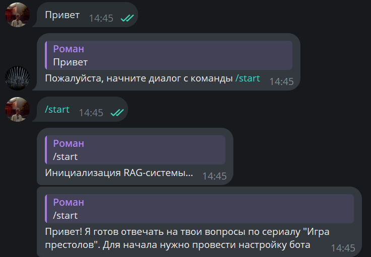
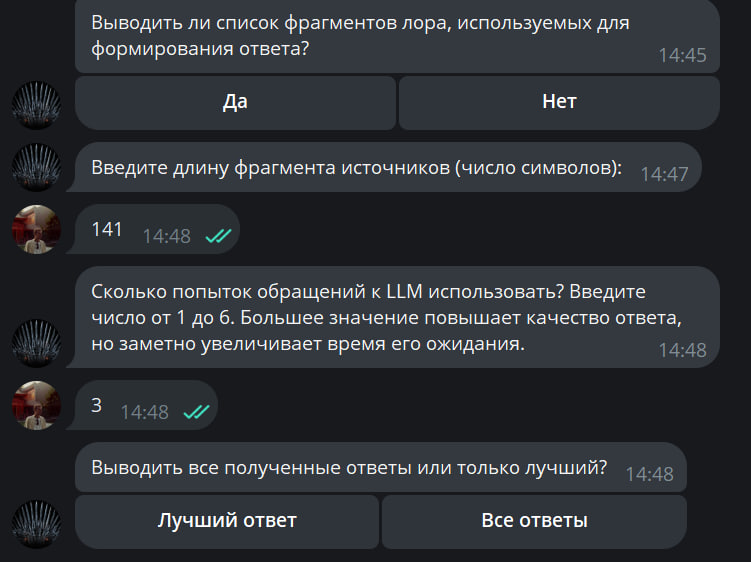
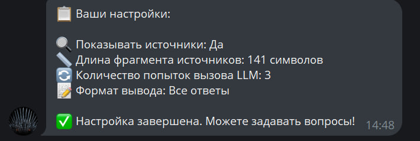
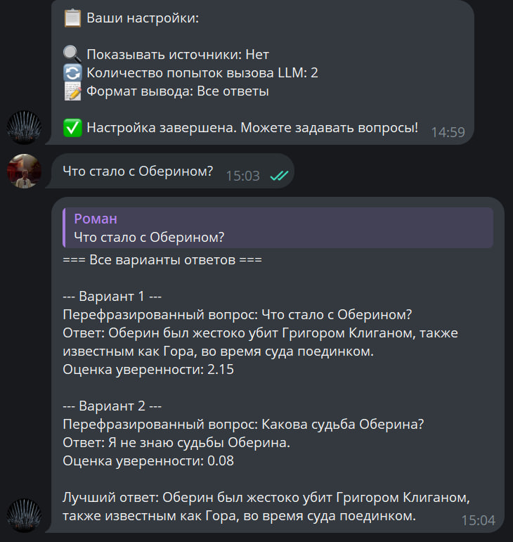
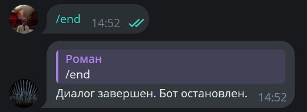

# RAG from scratch with MistralAI API

## Описание

В репозитории реализован пайплайн **Retrieval-Augmented Generation (RAG)** для обработки запросов и генерации ответов на основе предоставленной базы знаний. Пайплайн реализует поиск релевантных документов и генерацию ответа с использованием MistralAI. 

В качестве данных используется лор сериала "Игра престолов". Данные были получены путем парсинга сайта [Game of Thrones Wiki](https://gameofthrones.fandom.com/ru). Был произведен парсинг содержания всех эпизодов сериала, а также отдельно биографий 50 основных героев.

## Установка

1. Клонируйте репозиторий
   ```bash
   git clone https://github.com/featztex/RAG.git
   cd RAG
   ```
2. Получите доступ к моделям MistralAI на [сайте](https://mistral.ai/) и сохраните его в файл config.py
    ```python title="config.py"
   api_key = "<your MistralAI API key>"
   ```

Также создан телеграм-бот с доступом к модели [t.me/game_of_thrones_RAG_bot](t.me/game_of_thrones_RAG_bot). 

!!! В данный момент бот не хостится на сервере, поэтому доступ к нему ограничен !!!

## Пример использования
Пример запуска модели и комментарии к параметрам диалоговой функции можно найти в файле dialogue.py
```python
from main import start_dialogue
start_dialogue()
```

## Детали реализации
1. В качестве эмбединг-модели используется `"sergeyzh/LaBSE-ru-sts"`, обученная на русский язык.
2. В качестве retriever-а используется ансамбль из 2 моделей: `FAISS` и `TF-IDF` с ранжирующими весами 0.75 и 0.25 соответственно.
3. LLM — `mistral-large-2407` — большая текстовая модель Mistral AI, выпущенная 24 июля 2024 года (123 млрд параметров).
4. Используется техника мультиплицирования запроса. С помощью этой же модели исходный запрос перефразируется несколько раз, в итоге в LLM поступает целый список запросов. Затем ее ответы оцениваются с помощью собственноручно написанной функции оценки.
5. Оценочная функция основывается на следующих вещах:
    - длина ответа
    - согласованность ответа с используемыми источниками
    - фактическая информация (числа, даты, имена собственные)
    
    Также введена система бонусов и штрафов. Бонус начисляется в случае детекции структурированности и логической связности ответа, а штрафы - в случае слишком короткого / длинного ответа или при наличии неуверенности / прямого указания на незнание в ответе.


## Структура репозитория
1. В папке `data` содержится файл `all_content.txt`, представляющий из себя базу знаний, а также используемые парсеры и скрипты для объединения полученных файлов в единый `.txt` файл.
2. В файле `RAG_pipeline.py` реализован процесс создания RAG-цепочки.
3. `utils.py` содержит все вспомогательные функции для RAG.
4. В `main.py` содержатся функции для обращения к API, оценки ответов и ведения диалога с пользователем.
5. `dialogue.py` — пример запуска кода в режиме диалога.
6. `tg_bot.py` — код телеграм-бота, реализующий тот же функционал, что и функция `start_dialogue()`.


## Примеры ответов модели

| Вопрос                     | Ответ                                 |
|----------------------------|---------------------------------------|
| Какая фамилия у Дейенерис? Что известно о её семье?  | Фамилия Дейенерис — Таргариен.<br><br>О её родственниках можно рассказать следующее:<br>1.  Дейенерис была зачата во время восстания Роберта<br>2.  Её родители — король Эйерис II Таргариен и королева Рейла Таргариен<br>3.  У неё был старший брат, принц Визерис Таргариен<br>4.  Родители Дейенерис погибли, и её мать, Рейла, умерла вскоре после её рождения, оставив Дейенерис и её брата сиротами<br>5.  Дейенерис также имеет связь с Джоном Сноу, который оказывается её племянником, так как он сын Рейгара Таргариена (брата Дейенерис) и Лианны Старк |
| Как погиб Оберин? | Оберин Мартелл погиб в поединке с Григором Клиганом, также известным как Гора. Несмотря на то, что Оберин был искуснее в бою, он позволил себе издеваться над умирающим Клиганом, потеряв бдительность. В результате Клиган смог сбить с ног Оберина и раздавить ему череп. |
| Имена всех членов семьи Старк | <br><br>У всех членов семьи Старк следующие имена: <br>1. Эддард (Нед) Старк — глава семьи. <br>2. Кейтилин Старк — его жена. <br>3. Робб Старк — старший сын. <br>4. Санса Старк — старшая дочь. <br>5. Арья Старк — младшая дочь. <br>6. Бран Старк — второй сын. <br>7. Рикон Старк — младший сын. <br>8. Джон Сноу — незаконнорожденный сын Неда Старка (на самом деле его настоящее имя Эйгон Таргариен, и он сын Рейгара Таргариена и Лианны Старк).  |
| Откуда у Дейенерис появились драконы? | Дейенерис получила драконьи яйца в подарок на свадьбу от Иллирио Мопатиса. Она вошла в погребальный костёр с этими яйцами, и на следующее утро выяснилось, что она выжила, а к её телу прильнули три только что вылупившихся дракона — первые три дракона в мире за последние три столетия. |
| Расскажи про трёхглазого ворона и его способности | Трёхглазый ворон — это мистический персонаж, который обладает способностью видеть события, которые еще не произошли, произошли много лет назад или происходят прямо сейчас. Он также связан с Браном Старком, который становится Трёхглазым вороном и должен научиться контролировать свои способности. Бран Старк, став Трёхглазым вороном, также имеет способности варга, что позволяет ему видеть мир глазами животных и даже контролировать их действия. Однако, эта способность отличается от способностей Трёхглазого ворона, которые связаны с видением событий во времени. |
| Имена родителей Джоффри Баратеона | Настоящими родителями Джоффри Баратеона являются Серсея Ланнистер и её брат-близнец Джейме Ланнистер. Официально Джоффри считается сыном короля Роберта Баратеона и Серсеи Ланнистер. |


## Работа бота

Работа с ботом начинается с команды `/start`



Затем бот задаст 4 вопроса по поводу настройки его работы. Параметры ровно те же, что и при использовании команды `start_dialogue`



После этого будет выведено сообщение с установленными параметрами, а предыдущие сообщения о настройке бота будут удалены



Далее бот переходит в уже привычный диалоговый режим



Остановить работу бота можно с помощью команды `\end`




## Disclaimer

1. Данная модель не имеет памяти, то есть контекст с предыдущих запросов не сохраняется.
2. Время создания RAG-цепочки составляет 10 секунд, а время ответа на поставленный вопрос — от 5 до 25 секунд.
3. Время и качество ответа во многом зависит от параметра `num_attempts`, который задает количество запросов к LLM. Вопрос перефразируется `num_attempts` раз и весь список запросов подается в модель Mistral. Если Вы устанавливаете `num_attempts=1`, то время ответа составит пару секунд, но есть вероятность, что вы не получите нужного ответа и будете вынуждены самостоятельно перефразировать вопрос; при значении `num_attempts=5` качество ответа значительно повышается, но и время его ожидания кратно возрастает, поскольку установлен временной делей между обращениями к API.
4. Даже при установке высокого значения `num_attempts` модель не гарантирует идеального ответа, поскольку информация с используемого сайта не совсем полна и может не содержать некоторых деталей, упомянутых в сериале или книге.
5. Бот @game_of_thrones_RAG_bot в данный момент не хостится на сервере, поэтому доступ к нему весьма ограничен.